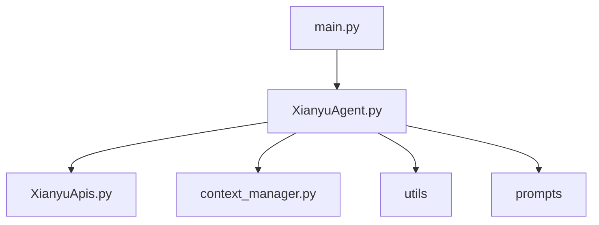

# Module Map

## Entry Points

- main.py → WebSocket Client & Event Loop
- XianyuAgent.py → Agent Orchestration & Intent Routing
- XianyuApis.py → Xianyu API Client
- context_manager.py → Chat Context Management
- utils/ → Utility Functions
- prompts/ → LLM System Prompts
