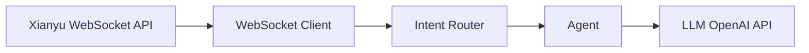

# System Map

## Architecture

## Layers

- Xianyu WebSocket API → External service connection
- WebSocket Client → Maintains live connection
- Intent Router → Classifies incoming messages
- Agent → Orchestrates responses
- LLM → Generates replies
