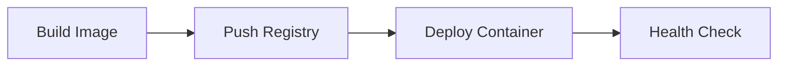

# Deploy Guide

## Docker Build

```bash
docker build -t xianyuautoagent .
```

## Docker Run

```bash
docker run -d --name xianyuautoagent \
  -v ./data:/app/data \
  -v ./prompts:/app/prompts \
  -v ./.env:/app/.env \
  xianyuautoagent
```

## Docker Compose

```bash
docker-compose up -d
```

## Deployment Pipeline


