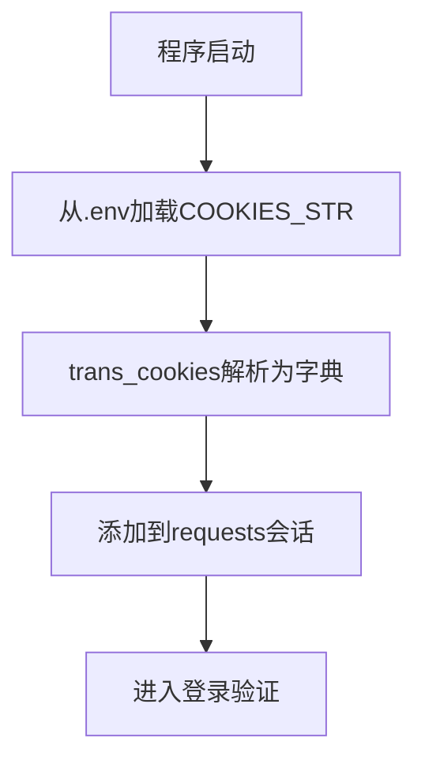
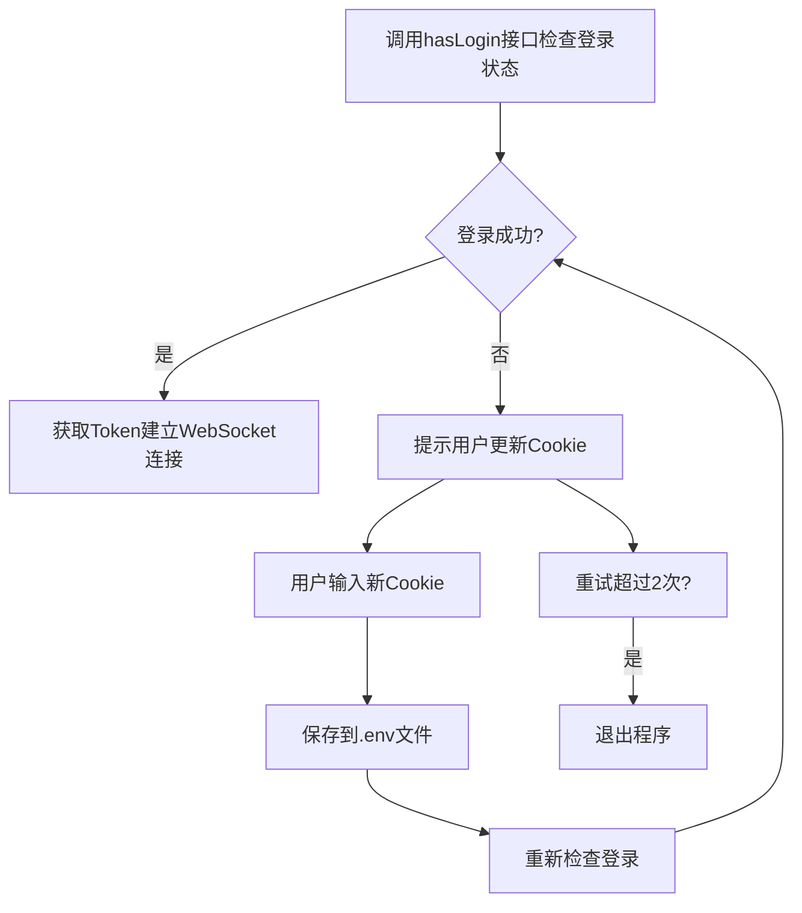

# 咸鱼自动Agent - 登录方案详解

## 📋 目录

- [方案概述](#方案概述)
- [认证方式](#认证方式)
- [项目结构](#项目结构)
- [登录流程详解](#登录流程详解)
- [关键代码分析](#关键代码分析)
- [配置说明](#配置说明)
- [优缺点分析](#优缺点分析)
- [Cookie获取方法](#cookie获取方法)

---

## 方案概述

XianyuAutoAgent 当前采用 **Cookie 会话认证方案**，通过复用浏览器已登录会话的 Cookie 来实现身份验证。这种方案避开了复杂的用户名密码登录流程，直接利用已有的登录状态进行 API 调用。

## 认证方式

### 核心思路
- **认证类型**：会话 Cookie 认证
- **依赖**：用户从浏览器导出的完整 Cookie 字符串
- **原理**：闲鱼网页端登录后，浏览器会保存一系列认证相关的 Cookie，程序直接使用这些 Cookie 维持登录状态

### 必需的 Cookie 字段

| Cookie 名称 | 作用 | 是否必需 |
|------------|------|----------|
| `cookie2` | 闲鱼核心会话标识 | ✅ 必需 |
| `t` | 登录令牌 | ✅ 必需 |
| `unb` | 用户标识 | ✅ 必需 |
| `_m_h5_tk` | 淘宝开放平台认证令牌 | ✅ 必需 |
| `_m_h5_tk_enc` | 淘宝开放平台加密令牌 | ✅ 必需 |
| 其他字段 | 辅助认证 | 推荐保留完整 |

## 项目结构

与登录认证相关的文件：

```
├── main.py              # 登录状态管理、Cookie更新逻辑、WebSocket连接入口
├── XianyuApis.py        # 封装登录相关API调用
├── utils/xianyu_utils.py # Cookie解析、签名生成等工具函数
├── context_manager.py   # 对话上下文管理（包含用户认证信息）
├── .env                 # 环境配置文件（存储COOKIES_STR）
└── docs/login-scheme.md # 本文档
```

### 各模块职责

| 模块 | 职责 |
|------|------|
| `main.py` | 程序入口，登录状态检查，Cookie自动更新，WebSocket连接维护 |
| `XianyuApis.py` | 封装 `hasLogin()`、`get_token()` 等登录相关API |
| `xianyu_utils.py` | `trans_cookies()` 解析Cookie字符串，`generate_sign()` 生成请求签名 |
| `.env` | 存储 `COOKIES_STR` 配置项 |

## 登录流程详解

### 1. 初始化阶段



### 2. 登录验证流程



### 3. 连接维护

- **心跳机制**：每 30 秒发送一次心跳包保持 WebSocket 连接活跃
- **Token 刷新**：每 1 小时自动刷新访问令牌
- **Cookie 自动更新**：API 响应返回的新 Cookie 会自动更新并保存到 `.env` 文件

## 关键代码分析

### Cookie 解析

位置：`utils/xianyu_utils.py:trans_cookies()`

```python
def trans_cookies(cookie_str):
    cookies = {}
    for cookie in cookie_str.split(';'):
        if not cookie:
            continue
        kv = cookie.split('=', 1)
        if len(kv) == 2:
            key = kv[0].strip()
            value = kv[1].strip()
            cookies[key] = value
    return cookies
```

功能：将 `name1=value1; name2=value2` 格式的 Cookie 字符串转换为字典，供 requests 库使用。

### 登录状态检查

位置：`XianyuApis.py:hasLogin()`

```python
def hasLogin(self):
    url = 'https://passport.goofish.com/newlogin/hasLogin.do'
    params = {'appId': '2021001107}
    # 携带当前Cookie发起请求
    response = self.session.get(url, params=params)
    result = response.json()
    # 检查返回结果判断是否登录
    return result.get('success')
```

### Token 获取

位置：`XianyuApis.py:get_token()`

- 使用当前 Cookie 调用闲鱼 API
- 通过 `generate_sign()` 生成请求签名
- 返回用于 WebSocket 连接的访问令牌

### Cookie 自动更新

位置：`main.py`

当 API 响应中包含新的 Cookie 时，程序会：
1. 提取新的 Cookie 信息
2. 更新内存中的 Cookie 字典
3. 重新格式化为 Cookie 字符串
4. 自动保存到 `.env` 文件中

**优点**：延长登录有效期，减少用户手动更新频率

## 配置说明

### `.env` 文件中与登录相关的配置

```env
# 核心配置 - 闲鱼登录Cookie字符串
COOKIES_STR=your_cookie_string_here

# 其他配置
API_KEY=your_api_key
MODEL_BASE_URL=https://api.example.com
MODEL_NAME=model-name

# 连接维护配置
HEARTBEAT_INTERVAL=30
TOKEN_REFRESH_INTERVAL=3600
```

### 获取 Cookie 步骤

1. 打开浏览器，访问 [闲鱼官网](https://www.goofish.com/)
2. 登录你的咸鱼账号
3. 按 F12 打开开发者工具
4. 切换到 Network（网络）标签
5. 刷新页面或点击任意请求
6. 在 Request Headers 中找到 `Cookie` 字段
7. 复制完整的 Cookie 字符串，粘贴到 `.env` 的 `COOKIES_STR` 中

## 优缺点分析

### 优点 ✅

| 优点 | 说明 |
|------|------|
| 实现简单 | 不需要处理滑块验证码、短信验证等复杂流程 |
| 开发快速 | 直接复用浏览器登录状态，代码量少 |
| 无需账号密码 | 用户不需要向程序提供账号密码 |
| 兼容性好 | 不依赖闲鱼特定的登录接口变化 |

### 缺点 ❌

| 缺点 | 说明 |
|------|------|
| Cookie 过期 | Cookie 有有效期，需要用户手动更新 |
| 依赖浏览器 | 需要先在浏览器登录获取 Cookie |
| 安全性 | Cookie 保存配置文件中，需要注意保密 |

## Cookie 获取方法

### Chrome 浏览器步骤

1. 访问 https://www.goofish.com/ 并登录
2. 按 `F12` 打开开发者工具
3. 切换到 **Network** 标签
4. 刷新页面
5. 在请求列表中点击第一个请求（域名是 goofish.com）
6. 在 **Headers** → **Request Headers** 找到 **Cookie**
7. 右键复制值，粘贴到 `.env` 文件中

### 开发者工具快捷获取

或者在开发者工具的 Console 中执行：

```javascript
console.log(document.cookie);
```

直接复制输出结果即可。

## 🔗 相关文档

- [消息接收方案](./message-receiving-scheme.md) - WebSocket 长连接接收消息方案
- [README](../README.md) - 项目首页

---

**文档更新日期**: 2026-03-17
