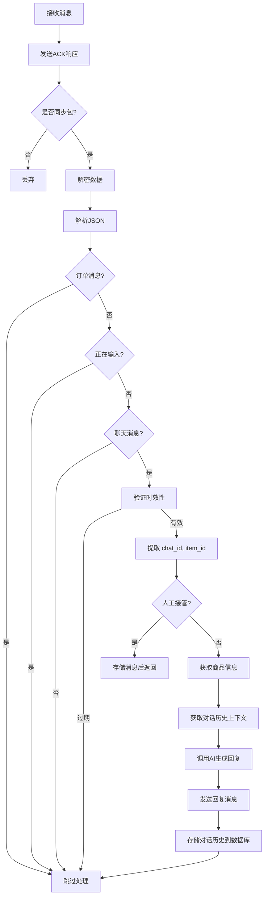

# 咸鱼消息获取技术方案

## 项目概述

XianyuAutoAgent 是一个基于 WebSocket 实时通信和大语言模型的咸鱼自动回复机器人系统。本文档总结了系统获取和处理咸鱼消息的整体技术方案。

## 整体架构

```
┌─────────────┐   ┌─────────────┐   ┌─────────────┐   ┌─────────────┐
│  WebSocket  │ → │  消息解密   │ → │  消息过滤   │ → │  AI 回复    │
│  连接管理    │   │  解析处理   │   │  类型判断   │   │  生成       │
└─────────────┘   └─────────────┘   └─────────────┘   └─────────────┘
         ↓              ↓               ↓               ↓
┌─────────────────────────────────────────────────────────────────┐
│                     对话历史存储 (SQLite)                         │
└─────────────────────────────────────────────────────────────────┘
```

## 核心组件

### 1. WebSocket 连接管理层 (`main.py` - `XianyuLive` 类)

**文件位置**: `main.py` 第 19-706 行

**核心功能**:

| 功能 | 方法 | 说明 |
|------|------|------|
| 连接建立 | `init()` | 初始化 WebSocket 连接，获取 token |
| 心跳维护 | `heartbeat_loop()`, `send_heartbeat()` | 定期发送心跳保持连接活跃 |
| Token 刷新 | `token_refresh_loop()`, `refresh_token()` | 定时刷新认证令牌 |
| 消息接收 | `main()` | 异步循环接收消息 |
| 消息处理 | `handle_message()` | 消息分发和处理入口 |

**消息接收主循环**:

```python
async for message in websocket:
    if self.connection_restart_flag:
        break  # 连接重启处理

    message_data = json.loads(message)

    # 处理心跳响应
    if await self.handle_heartbeat_response(message_data):
        continue

    # 发送 ACK 确认
    if "headers" in message_data and "mid" in message_data["headers"]:
        ack = {
            "code": 200,
            "headers": {
                "mid": message_data["headers"]["mid"],
                "sid": message_data["headers"].get("sid", "")
            }
        }
        await websocket.send(json.dumps(ack))

    # 处理业务消息
    await self.handle_message(message_data, websocket)
```

### 2. 消息解密解析层 (`utils/xianyu_utils.py`)

**文件位置**: `utils/xianyu_utils.py` 第 72-336 行

**解密流程**:

```
Base64 解码 → MessagePack 解码 → JSON 反序列化
```

**关键函数**:
- `decrypt()`: 对加密的消息内容进行解密
- `MessagePackDecoder`: MessagePack 格式解码器

咸鱼使用自定义加密格式传输消息，需要经过多级解码才能得到可读的 JSON 数据。

### 3. 消息处理流程 (`handle_message()`)

**文件位置**: `main.py` 第 356-552 行

完整处理流程:



### 4. 消息类型判断

**文件位置**: `main.py` 第 191-261 行

| 方法 | 功能 |
|------|------|
| `is_chat_message()` | 判断是否为用户聊天消息 |
| `is_sync_package()` | 判断是否为同步包消息 |
| `is_typing_status()` | 判断是否为正在输入状态 |
| `is_system_message()` | 判断是否为系统消息 |
| `is_bracket_system_message()` | 检查是否为带中括号的系统消息 |

只有用户发送的聊天消息才会进入 AI 自动回复流程，其他类型消息直接过滤。

### 5. 时效性验证

系统会过滤掉 5 分钟前的过期消息（可配置）：

```python
if (time.time() * 1000 - create_time) > self.message_expire_time:
    return  # 跳过过期消息
```

## 多会话对话记忆管理

### 5.1 对话上下文管理器 (`context_manager.py`)

系统使用 SQLite 数据库持久化存储对话历史，支持按会话 ID 管理多个对话。

**数据库表结构**:

```sql
-- 消息表：存储所有对话消息
CREATE TABLE IF NOT EXISTS messages (
    id INTEGER PRIMARY KEY AUTOINCREMENT,
    user_id TEXT NOT NULL,
    item_id TEXT NOT NULL,
    role TEXT NOT NULL,
    content TEXT NOT NULL,
    timestamp DATETIME DEFAULT CURRENT_TIMESTAMP,
    chat_id TEXT
);

-- 议价次数表：统计每个会话的议价次数
CREATE TABLE IF NOT EXISTS chat_bargain_counts (
    chat_id TEXT PRIMARY KEY,
    count INTEGER DEFAULT 0,
    last_updated DATETIME DEFAULT CURRENT_TIMESTAMP
);

-- 商品信息表：缓存商品详情
CREATE TABLE IF NOT EXISTS items (
    item_id TEXT PRIMARY KEY,
    data TEXT NOT NULL,
    price REAL,
    description TEXT,
    last_updated DATETIME DEFAULT CURRENT_TIMESTAMP
);
```

### 5.2 核心管理功能

| 功能 | 方法 | 说明 |
|------|------|------|
| 添加消息 | `add_message_by_chat()` | 按 chat_id 存储消息 |
| 获取上下文 | `get_context_by_chat()` | 按 chat_id 查询历史对话 |
| 商品缓存 | `save_item_info()`, `get_item_info()` | 缓存商品信息避免重复请求 |
| 议价统计 | `increment_bargain_count_by_chat()` | 统计每个会话议价次数 |

### 5.3 上下文获取示例

```python
def get_context_by_chat(self, chat_id):
    """基于会话ID获取对话历史"""
    cursor.execute(
        """
        SELECT role, content FROM messages
        WHERE chat_id = ?
        ORDER BY timestamp ASC
        LIMIT ?
        """,
        (chat_id, self.max_history)
    )

    messages = [{"role": role, "content": content} for role, content in cursor.fetchall()]

    # 将议价次数添加到上下文
    bargain_count = self.get_bargain_count_by_chat(chat_id)
    if bargain_count > 0:
        messages.append({
            "role": "system",
            "content": f"议价次数: {bargain_count}"
        })

    return messages
```

### 5.4 人工接管模式

系统支持对特定会话切换人工接管模式：

```python
def is_manual_mode(self, chat_id):
    """检查特定会话是否处于人工接管模式"""
    if chat_id not in self.manual_mode_conversations:
        return False

    # 超时自动退出
    current_time = time.time()
    if current_time - self.manual_mode_timestamps[chat_id] > self.manual_mode_timeout:
        self.exit_manual_mode(chat_id)
        return False

    return True
```

**特点**:
- 按 `chat_id` 粒度控制人工接管
- 支持超时自动退出（默认 1 小时，可配置）
- 人工接管模式下，消息只存储不自动回复

## AI 回复生成 (`XianyuAgent.py`)

### 生成流程

```python
def generate_reply(self, user_msg: str, item_desc: str, context: List[Dict]) -> str:
    # 1. 格式化历史上下文
    formatted_context = self.format_history(context)

    # 2. 意图识别路由
    detected_intent = self.router.detect(user_msg, item_desc, formatted_context)

    # 3. 选择对应的 Agent
    if detected_intent == 'no_reply':
        return "-"  # 不回复
    elif detected_intent in self.agents:
        agent = self.agents[detected_intent]
    else:
        agent = self.agents['default']

    # 4. 提取议价次数
    bargain_count = self._extract_bargain_count(context)

    # 5. 生成回复
    return agent.generate(
        user_msg=user_msg,
        item_desc=item_desc,
        context=formatted_context,
        bargain_count=bargain_count
    )
```

### 支持的意图路由

- `price`: 议价处理 → `PriceAgent`
- `tech`: 技术咨询 → `TechAgent`
- `default`: 默认回复 → `DefaultAgent`
- `no_reply`: 不回复

## API 层 (`XianyuApis.py`)

封装与咸鱼平台的 HTTP API 交互：

| 接口 | 功能 |
|------|------|
| `get_token()` | 获取 WebSocket 连接令牌 |
| `get_item_info(item_id)` | 获取商品详情 |
| `hasLogin()` | 检查登录状态 |
| `send_msg()` | 发送回复消息 |
| `clear_duplicate_cookies()` | 清理重复 Cookies |

## 配置参数

通过 `.env` 文件配置：

| 参数 | 说明 | 默认值 |
|------|------|------|
| `HEARTBEAT_INTERVAL` | 心跳间隔（秒） | 15 |
| `HEARTBEAT_TIMEOUT` | 心跳超时（秒） | 5 |
| `TOKEN_REFRESH_INTERVAL` | Token 刷新间隔（秒） | 3600 |
| `MESSAGE_EXPIRE_TIME` | 消息过期时间（毫秒） | 300000 (5分钟) |
| `MANUAL_MODE_TIMEOUT` | 人工接管超时（秒） | 3600 (1小时) |
| `TOGGLE_KEYWORDS` | 切换人工模式关键词 | 。 |
| `SIMULATE_HUMAN_TYPING` | 是否模拟人工打字 | False |

## 技术特点

### 优点

1. **实时性**: 基于 WebSocket 持久连接，消息延迟低
2. **多会话隔离**: 按 `chat_id` 管理对话，支持同时处理多个买家对话
3. **持久化记忆**: 使用 SQLite 存储对话历史，重启不丢失
4. **灵活控制**: 支持人工接管，可随时介入特定会话
5. **垃圾过滤**: 多层次消息过滤，只处理有效聊天消息
6. **过期处理**: 自动过滤历史过期消息，避免回复过时消息

### 局限性

1. 当前单进程单连接架构，仅支持单个账号
2. SQLite 单文件存储，并发量有限（对该场景足够）
3. 历史上下文长度限制，默认只保留最近 N 条消息

## 依赖库

```
websockets      # WebSocket 异步客户端
requests        # HTTP API 请求
python-dotenv   # 环境变量管理
loguru          # 日志记录
openai          # 大语言模型 API 调用
```

## 项目目录结构

```
XianyuAutoAgent/
├── main.py                    # 主入口，WebSocket连接和消息处理
├── XianyuApis.py              # 咸鱼API封装
├── XianyuAgent.py             # AI回复生成和意图路由
├── context_manager.py         # 对话上下文和数据库管理
├── utils/
│   └── xianyu_utils.py        # 解密工具函数
├── prompts/                   # AI提示词模板
├── data/                      # SQLite数据库存储目录
└── docs/
    └── message-receiving-scheme.md  # 本文档
```

## 总结

本方案通过 **WebSocket 持久连接 + 多级解密解析 + SQLite 多会话记忆管理 + LLM 意图路由** 的架构，实现了稳定可靠的咸鱼消息自动获取和回复系统。

核心设计要点：
- **连接层**: 心跳 + 定时刷新token保持连接稳定
- **过滤层**: 多维度消息过滤，只处理有效用户消息
- **记忆层**: 按chat_id隔离存储，支持多会话并发处理
- **应用层**: 基于意图路由的多Agent架构，灵活处理不同类型询问
